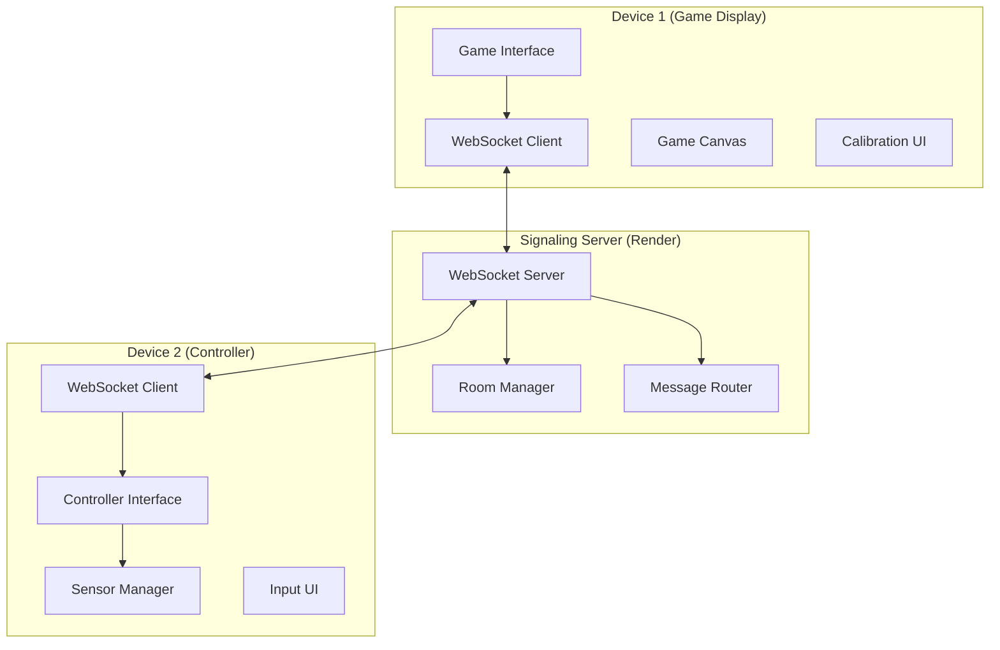

# Design Document

## Overview

Situp Bird is a distributed web application consisting of two main components: a lightweight Node.js signaling server for device pairing and real-time communication, and a unified single-page application (SPA) that serves as both game display and motion controller. The system uses WebSocket connections for real-time data transmission and leverages the Generic Sensor API for motion detection.

The architecture follows a client-server-client pattern where the signaling server acts as a message broker between game and controller devices, enabling seamless cross-device gameplay without complex network configuration.

## Architecture

### System Components



### Communication Flow

1. **Room Creation**: Game device connects to signaling server and creates a room with a 4-digit code
2. **Device Pairing**: Controller device joins room using the code
3. **Calibration**: Controller performs motion calibration and sends range data to game
4. **Gameplay**: Real-time sensor data flows from controller through server to game
5. **Game Logic**: Game processes motion data and updates visual state accordingly

### Technology Stack

- **Backend**: Node.js with `ws` library for WebSocket handling
- **Frontend**: Vanilla JavaScript, HTML5 Canvas, CSS3 animations
- **Sensors**: Generic Sensor API (Accelerometer)
- **Deployment**: Render (backend), GitHub Pages (frontend)
- **Communication**: WebSocket over WSS for secure real-time messaging

## Components and Interfaces

### Signaling Server

**Purpose**: Lightweight message broker for device pairing and real-time communication

**Key Classes/Modules**:
- `WebSocketServer`: Handles incoming connections
- `RoomManager`: Manages game rooms and participant tracking
- `MessageRouter`: Routes messages between paired devices

**API Messages**:
```javascript
// Room creation
{ type: 'CREATE_ROOM', code: '1234' }

// Room joining
{ type: 'JOIN_ROOM', code: '1234' }

// Connection success
{ type: 'CONNECTION_SUCCESS' }

// Sensor data transmission
{ type: 'SENSOR_DATA', code: '1234', payload: { z: -4.2, calibration: {...} } }

// Calibration data
{ type: 'CALIBRATION_DATA', code: '1234', payload: { min: -8.0, max: -2.0 } }

// Error handling
{ type: 'ERROR', message: 'Room not found or is full.' }

// Disconnection
{ type: 'PARTNER_DISCONNECTED' }
```

### Frontend Application

**Purpose**: Unified SPA serving as both game display and motion controller

**Screen Management**:
- `SelectionScreen`: Initial choice between game and controller modes
- `CalibrationScreen`: Motion range calibration interface (game mode only)
- `GameScreen`: Main game canvas and HUD
- `ControllerScreen`: Code input and sensor status interface

**Key Modules**:

#### Game Engine
```javascript
class GameEngine {
    constructor(canvas, calibrationData)
    updateBird(sensorData)
    spawnPipes()
    checkCollisions()
    updateScore()
    render()
}
```

#### Sensor Manager
```javascript
class SensorManager {
    constructor()
    requestPermissions()
    startCalibration()
    getCalibrationData()
    startSensorReading()
    processSensorData(rawData, calibration)
}
```

#### WebSocket Client
```javascript
class GameClient {
    connect(serverUrl)
    createRoom()
    sendCalibrationData(data)
    handleSensorData(data)
}

class ControllerClient {
    connect(serverUrl)
    joinRoom(code)
    sendSensorData(data)
    sendCalibrationData(data)
}
```

### Calibration System

**Purpose**: Personalize motion detection to user's physical capabilities and device orientation

**Calibration Flow**:
1. User selects "START GAME"
2. System displays calibration instructions
3. User performs full situp range (down → up → down)
4. System records min/max Z-axis values
5. User can manually adjust detected range
6. Calibration data is sent to controller for motion processing
7. Game room is created with calibration parameters

**Calibration Data Structure**:
```javascript
{
    minZ: -8.2,        // Lowest Z-axis value (lying down)
    maxZ: -2.1,        // Highest Z-axis value (sitting up)
    threshold: 0.5,    // Sensitivity threshold for flap detection
    smoothing: 0.3     // Smoothing factor for sensor noise
}
```

## Data Models

### Room Model
```javascript
{
    code: "1234",
    participants: [gameSocket, controllerSocket],
    calibrationData: {
        minZ: -8.0,
        maxZ: -2.0,
        threshold: 0.5
    },
    createdAt: timestamp,
    status: "waiting" | "calibrating" | "playing" | "ended"
}
```

### Game State Model
```javascript
{
    bird: {
        x: 100,
        y: 300,
        width: 50,
        height: 40,
        velocity: 0,
        gravity: 0.2
    },
    pipes: [{
        x: 800,
        y: 400,
        width: 80,
        gap: 200,
        scored: false
    }],
    score: 0,
    gameState: "start" | "calibrating" | "playing" | "over",
    frame: 0
}
```

### Sensor Data Model
```javascript
{
    z: -4.2,           // Current Z-axis acceleration
    timestamp: Date.now(),
    processed: {
        isDown: false,
        shouldFlap: true,
        gapPosition: 0.7  // 0-1 range for pipe gap positioning
    }
}
```

## Error Handling

### Connection Errors
- **WebSocket connection failure**: Display retry mechanism with exponential backoff
- **Room not found**: Clear error message with option to re-enter code
- **Room full**: Inform user and suggest creating new game
- **Partner disconnection**: Pause game and display reconnection status

### Sensor Errors
- **Permission denied**: Clear instructions for enabling sensor access
- **Sensor not supported**: Fallback message explaining browser/device limitations
- **Calibration failure**: Option to retry calibration or use default values
- **Sensor data interruption**: Graceful degradation with last known values

### Game Errors
- **Canvas rendering issues**: Fallback to basic rendering mode
- **Audio context errors**: Silent mode with visual feedback only
- **Performance issues**: Dynamic quality adjustment based on frame rate

## Testing Strategy

### Unit Testing
- **Sensor data processing**: Test calibration algorithms and motion detection
- **Game physics**: Verify bird movement, collision detection, and scoring
- **Message routing**: Test WebSocket message handling and room management
- **Calibration logic**: Validate range detection and threshold calculations

### Integration Testing
- **Device pairing**: Test room creation and joining across different browsers
- **Real-time communication**: Verify low-latency sensor data transmission
- **Cross-browser compatibility**: Test on Chrome, Safari, Firefox, Edge
- **Mobile responsiveness**: Test on various screen sizes and orientations

### End-to-End Testing
- **Complete gameplay flow**: From device pairing through game completion
- **Calibration workflow**: Full calibration process with different motion ranges
- **Error scenarios**: Connection drops, invalid codes, sensor failures
- **Performance testing**: Sustained gameplay with consistent frame rates

### Manual Testing
- **Motion accuracy**: Real-world situp motion detection across different users
- **Accessibility**: Test with users of varying physical capabilities
- **Device combinations**: Various phone/display device pairings
- **Network conditions**: Test under different connection qualities

## Performance Considerations

### Real-time Communication
- **Target latency**: <100ms from sensor reading to game response
- **Message optimization**: Minimal payload size for sensor data
- **Connection pooling**: Efficient WebSocket connection management
- **Heartbeat mechanism**: Detect and handle connection drops quickly

### Game Rendering
- **60 FPS target**: Smooth animation and responsive controls
- **Canvas optimization**: Efficient drawing operations and object pooling
- **Memory management**: Proper cleanup of game objects and event listeners
- **Battery optimization**: Efficient sensor polling and rendering cycles

### Scalability
- **Room cleanup**: Automatic removal of inactive rooms
- **Memory limits**: Efficient data structures for free tier hosting
- **Connection limits**: Handle multiple concurrent games within platform constraints
- **Error recovery**: Graceful degradation under high load conditions